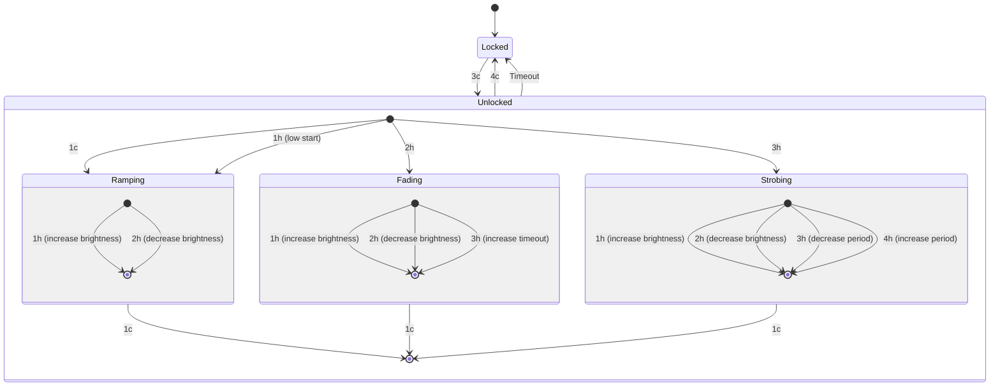

# Flashlight firmware, written in rust

https://github.com/simmsb/tyrfing/assets/5330444/455c9a46-7eb3-438b-a824-84d08574c565

This is flashlight firmware for the lume series of drivers (attiny1616/avr32dd20), written in Rust. 
It supports thermal and voltage regulation that prevents LED and battery damage by reducing output as temperature increases, and prevents usage when the battery voltage is too low.

The UI is implemented using async rust, which makes adding new modes of operation fairly trivial.

The UI and features are inspired by the
[Andúril](https://github.com/ToyKeeper/anduril) firmware

## Current UI

This might be wrong, the [source code is here](./src/states.rs)

## Thanks

This project relies on and makes modifications to:

- [Embassy](https://github.com/embassy-rs/embassy)
- [atxtiny-hal](https://github.com/G33KatWork/atxtiny-hal)
- [avr-device](https://github.com/Rahix/avr-device)
- [Andúril](https://github.com/ToyKeeper/anduril): Used as a reference for AVR
  and power related things.

## EMBASSY on an attiny1616/avr32dd20

This is some messing around with embassy on AVR (attiny1616)

The time driver ticks at 64hz and I've modified embassy to use a u32 tick
counter, which at 64hz won't overflow for just enough time for this to be useful
to me
